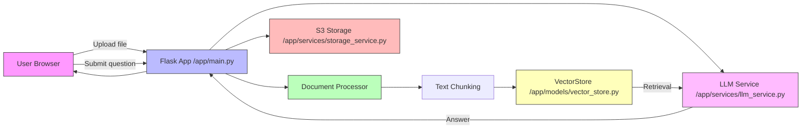

# Full System Architecture

```mermaid
flowchart LR
    A[User Browser] -->|Upload file| B[Flask App /app/main.py]
    A -->|Submit question| B
    B --> C[Document Processor]
    C --> D[Text Chunking]
    D --> E[VectorStore /app/models/vector_store.py]
    B --> F[S3 Storage /app/services/storage_service.py]
    B --> G[LLM Service /app/services/llm_service.py]
    E -->|Retrieval| G
    G -->|Answer| B
    B --> A
    style A fill:#f9f,stroke:#333,stroke-width:1px
    style B fill:#bbf,stroke:#333,stroke-width:1px
    style C fill:#bfb,stroke:#333,stroke-width:1px
    style E fill:#ffb,stroke:#333,stroke-width:1px
    style F fill:#fbb,stroke:#333,stroke-width:1px
    style G fill:#fbf,stroke:#333,stroke-width:1px
```