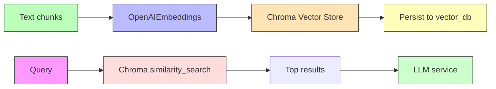

# Vector Store Component

```mermaid
flowchart LR
    A[Text chunks] --> B[OpenAIEmbeddings]
    B --> C[Chroma Vector Store]
    C --> D[Persist to vector_db]
    E[Query] --> F[Chroma similarity_search]
    F --> G[Top results]
    G --> H[LLM service]
    style A fill:#bfb,stroke:#333
    style B fill:#bbf,stroke:#333
    style C fill:#ffe4b5,stroke:#333
    style D fill:#ffb,stroke:#333
    style E fill:#f9f,stroke:#333
    style F fill:#fdd,stroke:#333
    style H fill:#cfc,stroke:#333
```